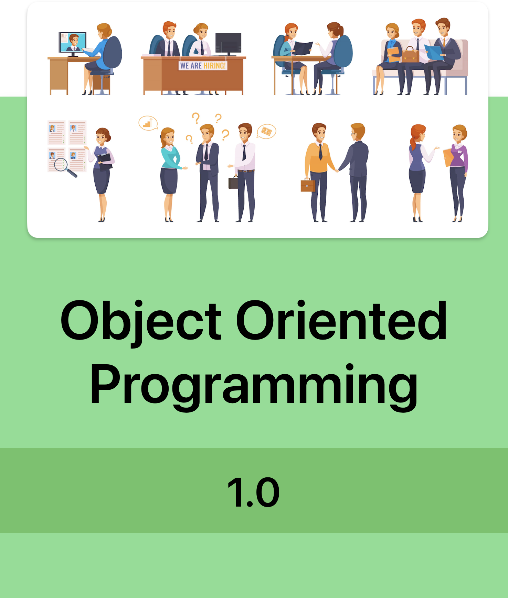

# OOPs 1.0 - Beginner to Proficient 


### Overview 
In this comprehensive course, you'll embark on a journey from absolute beginner to proficient OOP developer. Whether you're completely new to programming or seeking to enhance your skills, this course covers everything you need to know about OOP concepts and their practical implementation in Java.

### Programming Language
Java


```json

{
  "title": "Object Oriented Programming 1.0",
  "topics": [
    {
      "section": "Introduction to Object",
      "contents": [
        {
          "title": "What is an Object",
          "duration": "30",
          "preview" : false
        },
        {
          "title": "What is Class",
          "duration": "30",
          "preview" : false
        },
        {
          "title": "Data Members",
          "duration": "30",
          "preview" : false
        },
        {
          "title": "Member Methods",
          "duration": "30",
          "preview" : false
        },
        {
          "title": "Class Diagram",
          "duration": "30",
          "preview" : false
        },
        {
          "title": "How to create Object(s)",
          "duration": "30",
          "preview" : false
        },
        {
          "title": "Dot Operator",
          "duration": "30",
          "preview" : false
        },
        {
          "title": "Change State of Object",
          "duration": "30",
          "preview" : false
        },
        {
          "title": "Invoke Object's Method",
          "duration": "30",
          "preview" : false
        },
        {
          "title": "Object Reference",
          "duration": "30",
          "preview" : false
        },
        {
          "title": "Object in Memory",
          "duration": "30",
          "preview" : false
        },
        {
          "title": "Object Assignments",
          "duration": "30",
          "preview" : false
        }
      ]
    },
    {
      "section": "Introduction to Object",
      "contents": [
        {
          "title": "What is an Object",
          "duration": "30",
          "preview" : false
        },
        {
          "title": "What is Class",
          "duration": "30",
          "preview" : false
        },
        {
          "title": "Data Members",
          "duration": "30",
          "preview" : false
        },
        {
          "title": "Member Methods",
          "duration": "30",
          "preview" : false
        },
        {
          "title": "Class Diagram",
          "duration": "30",
          "preview" : false
        },
        {
          "title": "How to create Object(s)",
          "duration": "30",
          "preview" : false
        },
        {
          "title": "Dot Operator",
          "duration": "30",
          "preview" : false
        },
        {
          "title": "Change State of Object",
          "duration": "30",
          "preview" : false
        },
        {
          "title": "Invoke Object's Method",
          "duration": "30",
          "preview" : false
        },
        {
          "title": "Object Reference",
          "duration": "30",
          "preview" : false
        },
        {
          "title": "Object in Memory",
          "duration": "30",
          "preview" : false
        },
        {
          "title": "Object Assignments",
          "duration": "30",
          "preview" : false
        }
      ]
    },
    {
      "section": "Introduction to Object",
      "contents": [
        {
          "title": "What is an Object",
          "duration": "30",
          "preview" : false
        },
        {
          "title": "What is Class",
          "duration": "30",
          "preview" : false
        },
        {
          "title": "Data Members",
          "duration": "30",
          "preview" : false
        },
        {
          "title": "Member Methods",
          "duration": "30",
          "preview" : false
        },
        {
          "title": "Class Diagram",
          "duration": "30",
          "preview" : false
        },
        {
          "title": "How to create Object(s)",
          "duration": "30",
          "preview" : false
        },
        {
          "title": "Dot Operator",
          "duration": "30",
          "preview" : false
        },
        {
          "title": "Change State of Object",
          "duration": "30",
          "preview" : false
        },
        {
          "title": "Invoke Object's Method",
          "duration": "30",
          "preview" : false
        },
        {
          "title": "Object Reference",
          "duration": "30",
          "preview" : false
        },
        {
          "title": "Object in Memory",
          "duration": "30",
          "preview" : false
        },
        {
          "title": "Object Assignments",
          "duration": "30",
          "preview" : false
        }
      ]
    },
    {
      "section": "Introduction to Object",
      "contents": [
        {
          "title": "What is an Object",
          "duration": "30",
          "preview" : false
        },
        {
          "title": "What is Class",
          "duration": "30",
          "preview" : false
        },
        {
          "title": "Data Members",
          "duration": "30",
          "preview" : false
        },
        {
          "title": "Member Methods",
          "duration": "30",
          "preview" : false
        },
        {
          "title": "Class Diagram",
          "duration": "30",
          "preview" : false
        },
        {
          "title": "How to create Object(s)",
          "duration": "30",
          "preview" : false
        },
        {
          "title": "Dot Operator",
          "duration": "30",
          "preview" : false
        },
        {
          "title": "Change State of Object",
          "duration": "30",
          "preview" : false
        },
        {
          "title": "Invoke Object's Method",
          "duration": "30",
          "preview" : false
        },
        {
          "title": "Object Reference",
          "duration": "30",
          "preview" : false
        },
        {
          "title": "Object in Memory",
          "duration": "30",
          "preview" : false
        },
        {
          "title": "Object Assignments",
          "duration": "30",
          "preview" : false
        }
      ]
    }
  ]
}
```